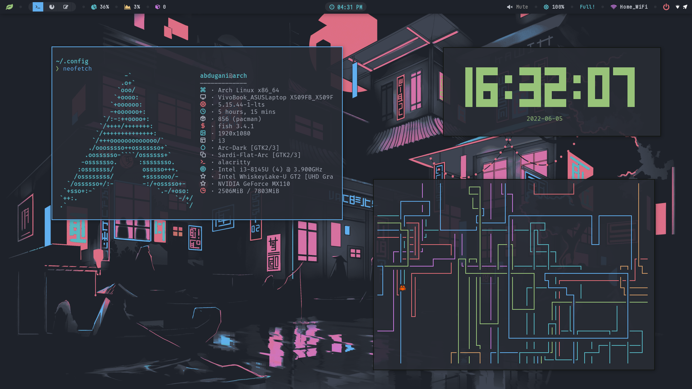

# I3 WM
Screenshot



## How to install

1. Clone and enter the repo
    ```c 
    git clone https://github.com/abdugani0523/i3wm-dotfiles.git && cd i3wm-dotfiles
    ```
2. Change the permissions of the script
    ```c 
    sudo chmod +x ./install.sh
    ```
3. Install config
    ```c
    ./install.sh
    ```
